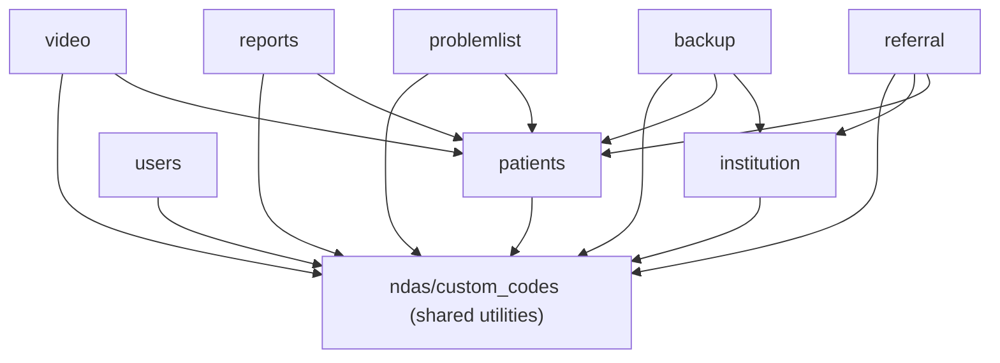
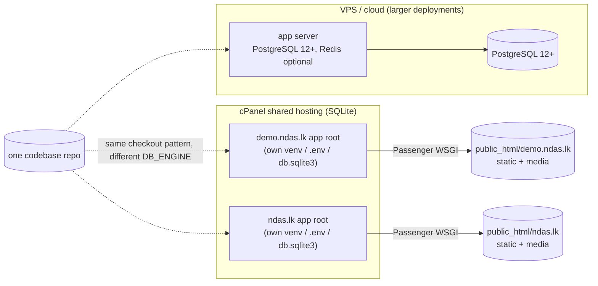
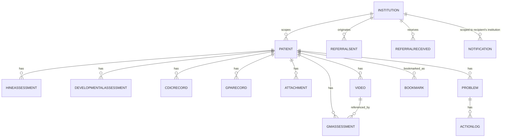

# Architecture Spine — NDAS

## Design Paradigm

**Django Monolithic MVT.** One Django process owns business logic, data access, and rendering. Templates are server-rendered; HTMX supplies partial-page dynamic interaction. There is no separate API layer, no SPA frontend, no microservices split. Layers map directly to Django's own: `models.py` (data), `views.py` (controller/business logic), `templates/<app>/` (presentation) — plus a shared cross-cutting layer, `ndas/custom_codes/`, that every domain app depends on and nothing depends on in reverse.

## Invariants & Rules



### AD-1 — Monolithic MVT, no parallel API surface

- **Binds:** all apps
- **Prevents:** a future feature introducing a parallel API surface (DRF, GraphQL, a JS SPA talking JSON) that fragments the single server-rendered paradigm
- **Rule:** all dynamic UI goes through server-rendered templates + HTMX partials; `JsonResponse` is permitted only as an HTMX/AJAX partial-data endpoint for an existing page, never as a general-purpose external API

### AD-2 — One-way dependency on `custom_codes`

- **Binds:** all apps + `ndas/custom_codes`
- **Prevents:** circular imports, and shared-utility logic forking per app (two apps each writing their own sanitizer)
- **Rule:** cross-cutting logic (validators, sanitization, delete rules, error handling, abstract base models) lives only in `ndas/custom_codes/`; a domain app needing shared behavior imports it rather than reimplementing it locally; `custom_codes` never imports a domain app

### AD-3 — Mandatory base model inheritance

- **Binds:** all models (except `CustomUser`, which extends `AbstractUser`)
- **Prevents:** an app hand-rolling its own timestamp/audit fields with divergent names/semantics, breaking generic admin/reporting/delete code that assumes `created_at`/`updated_at`/`added_by`/`last_edit_by` exist
- **Rule:** `class MyModel(TimeStampedModel, UserTrackingMixin)` is mandatory for new models; `added_by`/`last_edit_by` are never set manually in view code

### AD-4 — User-tracking is middleware-populated, not view-populated

- **Binds:** all apps with user-tracked models
- **Prevents:** divergent manual population (some views setting `added_by=request.user`, others forgetting, others setting it wrong on edit vs. create)
- **Rule:** `UserActivityMiddleware` is the single population path for `added_by`/`last_edit_by`; views never set them directly

### AD-5 — Standard view stack

- **Binds:** all views
- **Prevents:** inconsistent error handling, missing rate limits on CRUD, `DoesNotExist` leaking as a raw 500 instead of a 404
- **Rule:** every single-object view uses `get_object_or_404()`; create/edit endpoints carry a 10/m ratelimit, delete endpoints 5/m, login 5/m; cross-cutting exceptions route through `@handle_view_errors` / `@log_and_suppress` rather than ad hoc per-view `try/except`

### AD-6 — Delete permission logic is centralized

- **Binds:** all deletable entities
- **Prevents:** each app writing its own delete-permission check and silently diverging (one app lets staff delete others' records; one forgets to block deleting a Video referenced by a GMA assessment); a staff user passing the centralized `added_by == request.user` check on a record that belongs to a *different institution* than their own
- **Rule:** any new deletable entity's permission/business-rule check is added to `delete_helpers.py`, and its template includes the shared `delete_confirmation_modal.html` partial — never a bespoke per-app delete check. For any institution-scoped entity (AD-9), `has_delete_permission()` must also deny when the entity's institution differs from `request.institution`, even when the `added_by` check would otherwise pass — SUPERADMIN is the sole exception, by design

### AD-7 — Sanitization and export-escaping are mandatory choke points

- **Binds:** all apps accepting free text input or producing Excel exports
- **Prevents:** an XSS hole from one app skipping sanitization, or a formula-injection hole (leading `=`, `+`, `-`, `@`) from an export path that forgot `escape_excel_row()`
- **Rule:** no model/form field holding user free text is saved or rendered without passing through `sanitize_text_input()` / `sanitize_html()` / `sanitize_plain_text()`; no Excel export appends a row of user-controlled cells without `escape_excel_row()` / `escape_excel_formula()`. This applies regardless of entry path — form submission, bulk/backup import, or a value copied by a signal handler — not only the common single-form case

### AD-8 — File uploads go through one validation pipeline

- **Binds:** every `FileField`/`ImageField` that accepts a user-supplied upload, in any app, present or future — not a closed app list
- **Prevents:** a new upload type skipping MIME verification because its own app wrote a shortcut extension-only check (or no check at all)
- **Rule:** any file-upload field runs through the shared `custom_codes/validators.py` pipeline (extension allowlist, size limit, `python-magic` MIME check, `sanitize_filename()`) — never a bespoke per-app check, and never a bare `ImageField`/`FileField` with only a `help_text` claim of a limit
- **Known current violation:** `reports.ReportTemplate.logo` (`reports/models.py`) is a bare `ImageField` with no `validators=`, no MIME check, and no enforced size limit — only a help-text comment claiming "max 5MB." Needs remediation; see Deferred

### AD-9 — Institution scoping goes through the manager, never a hand-filter

- **Binds:** patients, institution, referral, and any future institution-scoped model
- **Prevents:** a view hand-filtering `.filter(institution=request.institution)` and missing the SUPERADMIN-sees-all / legacy-`None` case, silently hiding or leaking cross-institution data
- **Rule:** institution-scoped queries always go through `InstitutionScopedManager.for_institution(request.institution)`; no app hand-rolls an institution filter. `for_institution(None)` returns every institution's rows unfiltered — that call is reserved for a confirmed SUPERADMIN request context or Phase-1-legacy data, never used as a default/fallback when `request.institution` failed to resolve. A view must not treat "institution didn't resolve" and "SUPERADMIN intentionally wants all institutions" as the same code path

### AD-10 — Institution-scoped files use institution-aware paths

- **Binds:** video, patients (attachments), institution, and any future institution-scoped upload — not a closed app list
- **Prevents:** a new institution-scoped upload type landing files outside the per-institution partition, breaking filesystem-level data isolation
- **Rule:** any institution-scoped `FileField` uses an institution-aware path generator (`get_institution_*_path`); the legacy non-partitioned generators are never used for new upload types. A `FileField` on a model that itself carries no institution scope (e.g. a global, non-institution-scoped template) is out of scope for this AD but must still satisfy AD-8

### AD-11 — Referral records stay FK-independent; one writer per notification trigger

- **Binds:** referral; `backup` for the notification-writer clause
- **Prevents:** a convenience FK between `ReferralSent` and `ReferralReceived` reintroducing cross-institution cascade coupling, or a notification created inline in a view/command that bypasses its module's declared single-writer path and gets missed when a second trigger later fires the same event
- **Rule:** `ReferralSent`/`ReferralReceived` stay FK-independent, joined only via a shared `referral_uuid`; `snapshot_data` is never mutated after creation. `Notification` rows have exactly one writer per triggering domain: referral-lifecycle notifications are created only from `referral/signals.py`; a different domain (e.g. backup-job notifications) may have its own single writer, but it must be a signal handler or an equally centralized single call site — never created inline from multiple views/commands within the same domain
- **Known current violation:** `backup/notifications.py` calls `Notification.objects.create()` directly from a management command, while `referral/signals.py` carries a docstring claiming "All `Notification.objects.create()` calls live here — never in view files" — that claim is false today. Needs remediation (either move backup's notification creation to its own signal, or correct the docstring's scope); see Deferred

### AD-12 — Service-layer threshold for multi-step workflows

- **Binds:** backup, and any future multi-step/transactional/background-style workflow
- **Prevents:** a complex multi-stage operation crammed into one fat view function with no concurrency guard, or conversely simple CRUD over-engineered with a needless service layer
- **Rule:** a workflow gets its own service module(s) — plus an explicit lock (the `job_lock.py` pattern) if concurrent invocation is possible — when it meets *any* of: (a) writes to more than one model as a unit that must not partially apply, (b) can be triggered concurrently by two requests/processes for the same target, or (c) needs an audit trail or rollback path. A workflow meeting none of these (single-model create/edit/delete, even if it touches 2-3 fields across a couple of `if` branches) stays view-direct — "more than one stage" alone is not the test

### AD-13 — Security middleware order is fixed; config stays out of code

- **Binds:** `ndas/settings.py` `MIDDLEWARE`
- **Prevents:** a new cross-cutting concern inserted at an arbitrary position silently breaking a security invariant (CSRF/session/auth ordering, security headers landing after the response is built)
- **Rule:** new middleware is appended only at a documented, reasoned position relative to the existing 14; the existing order is never changed as a side effect of an unrelated feature. All secret/environment-dependent values (keys, credentials, host-specific config) are read via `python-decouple`'s `config(...)`, never hardcoded or committed — a security-config invariant, not just the middleware ordering

### AD-14 — Tests stay inside the per-app `tests/` package

- **Binds:** all apps' test suites
- **Prevents:** a new app or contributor adding `tests.py` next to an existing `tests/` package and silently breaking bare `manage.py test` discovery project-wide
- **Rule:** every app with a `tests/` package keeps all test modules inside it; a top-level `tests.py` is never added alongside one

### AD-15 — Deployment stays DB-engine-agnostic across both hosting shapes

- **Binds:** deployment / environments (both shapes)
- **Prevents:** a feature silently assuming Postgres-only behavior that breaks the SQLite/cPanel shape, or two domains on one cPanel account sharing a checkout and clobbering each other's `.env`/`db.sqlite3`
- **Rule:** new features stay ORM-portable unless explicitly gated by `DB_ENGINE`; each cPanel domain (demo/live) keeps its own full app root, venv, `.env`, and `db.sqlite3` — never a shared checkout
- **Known current violation:** `db.sqlite3` and `passenger_wsgi.py` are tracked in this git repository today (verified via `git ls-files`), not excluded in `.gitignore` (only `test_db.sqlite3` is). A repo containing patient data in `db.sqlite3` must never be committed — this needs remediation before the next production sync, not just isolated app roots on the server; see Deferred

## Consistency Conventions

| Concern | Convention |
| --- | --- |
| Naming (entities, files, interfaces, events) | Templates: `manager.html` (list), `add.html` (create), `edit.html` (update), `view.html` (detail). Choices: all `TextChoices` live in `custom_codes/choice.py`, never inline on a model. URL prefix per app (`/users/`, `/video/`, `/reports/`, `/problems/`, `/institution/`, `/referral/`); `patients` mounts at root `/`. |
| Data & formats (ids, dates, error shapes, envelopes) | Medical identifier field names are fixed and non-obvious — `bht`, `nnc_no`, `baby_name`, `dob_tob`, `pog_wks`/`pog_days`, `birth_weight`, `hc`, `apgar_1`/`apgar_5` (never `bht_number`, `date_of_birth`, etc. — see CLAUDE.md). PKs are `BigAutoField`. Cross-institution referral join key is `referral_uuid` (UUID), not a numeric FK. Ages computed via `python-dateutil.relativedelta`, never manual date math. |
| State & cross-cutting (mutation, errors, logging, config, auth) | Auth via `@login_required(login_url="user-login")`; rate tiers and secrets handling are AD-5/AD-13 rules, not restated here. Security/application logs split: `logs/django.log` vs `logs/security.log`. |

## Stack

| Name | Version |
| --- | --- |
| Django | ~=5.2.0 (LTS; pinned off 6.0 — cPanel hosts top out at Python 3.11.15, Django 6.0 needs >=3.12) |
| Python | 3.10+ (3.11 recommended) |
| Database (dev / cPanel) | SQLite 3 |
| Database (VPS/prod option) | PostgreSQL 12+ |
| AdminLTE | 3.2 |
| Bootstrap | 4.6 |
| Font Awesome | 6.4 |
| HTMX | 1.9.12 (vendored at `static/vendor/htmx/`, not tracked in requirements.txt) |
| Video.js | 8.10.0 (vendored at `static/vendor/videojs/`, not tracked in requirements.txt) |
| bleach | 6.3.0 |
| openpyxl | 3.1.5 |
| reportlab | 4.4.3 |
| django-ratelimit | 4.1.0 |
| django_csp | 3.8 |
| whitenoise | 6.9.0 |
| django-cleanup | 7.0.0 |
| python-magic | 0.4.27 (+ python-magic-bin, win32 only) |
| moviepy | 2.2.1 |
| playwright | 1.55.0 (test tooling) |
| Redis | optional — prod cache/session backend when configured; LocMem/cached_db otherwise |

## Structural Seed

```text
NDAS/
  ndas/                    # project core: settings, urls, views (error handlers)
    custom_codes/          # shared cross-cutting layer — AD-2
  patients/                # core domain, mounted at / (assessments, attachments, bookmarks)
  users/                   # auth, user tracking, subscription — mounted at /users/
  video/                   # video upload/metadata/viewing — mounted at /video/
  reports/                 # PDF/Excel generation — mounted at /reports/
  problemlist/             # problem CRUD + audit log — mounted at /problems/
  backup/                  # backup & restore — service-layer pattern (AD-12)
  institution/             # multi-institution scoping — mounted at /institution/
  referral/                # cross-institution referrals — mounted at /referral/
  templates/src/           # base.html, basic_plane.html, shared partials
  _bmad-output/            # BMad planning artifacts (this spine lives here)
```





## Deferred

**Urgent — address before the next production sync/deploy, not just "later":**

- **`db.sqlite3` and `passenger_wsgi.py` are tracked in git** (verified via `git ls-files`; only `test_db.sqlite3` is gitignored). A repo containing a SQLite file that may hold patient data must not be committed. Remediate (stop tracking, purge from history if patient data was ever committed, add `db.sqlite3` to `.gitignore`) before the next push to a shared/production remote. This directly contradicts AD-15's per-domain isolation claim — reality should be fixed to match the AD, not the other way around.
- **No Postgres driver pinned.** `settings.py` has a full Postgres `DATABASES` branch for VPS deploys, but no `psycopg`/`psycopg2` is in `requirements.txt`. If a VPS deploy is planned soon, pin it explicitly (main `requirements.txt` or a `requirements-postgres.txt`) rather than discovering the gap at deploy time.
- **AD-11 live violation:** `backup/notifications.py` creates `Notification` rows directly from a management command, contradicting `referral/signals.py`'s own docstring claim of exclusive ownership. Fix by giving backup its own signal-based writer or by correcting the docstring's claimed scope — see AD-11.
- **AD-8 live gap:** `reports.ReportTemplate.logo` is an unvalidated `ImageField` (no MIME check, no enforced size limit) — see AD-8.

**Can wait — revisit when the area is next touched:**

- **No Redis driver pinned.** `settings.py` has a full `django_redis` `CACHES`/`SESSION_ENGINE` branch, but neither `redis` nor `django-redis` is in `requirements.txt`. Same class of gap as the Postgres driver — pin when Redis is actually turned on in an environment.
- **Task queue / Celery.** `requirements.txt` carries Celery's own dependency chain (`amqp`, `billiard`, `kombu`, `vine`, `click-didyoumean`/`plugins`/`repl`) with no `celery` package and no task-queue code in the repo. Not decided whether this is a planned future addition or stray transitive pins — don't build against an assumed queue until confirmed.
- **Stale brownfield docs.** `docs/architecture.md` / `docs/project-overview.md` (2026-03-09) state Django 4.2.16 / Python 3.9+ and omit the `backup` app; current reality is Django ~=5.2.0, Python 3.10+, `backup` active. Refresh via `bmad-project-context`, independent of this spine.
- **No centralized choke point for outbound email.** SMTP/verification email config lives in `settings.py`, but unlike file uploads (AD-8) or free text (AD-7) there's no shared "send" helper enforcing consistent handling — low risk today, worth a convention if email use grows beyond verification/notification mail.
- **Feature-level data models and UX detail.** This spine fixes system-wide invariants only; per-feature schema, forms, and UX choices belong to the feature/epic-altitude spec and spine that inherit from this one.
- **Formal test framework / CI.** No CI pipeline or formalized test-design strategy found beyond per-app `tests/` packages and ad hoc `manage.py test`. Route through the Test Architecture Enterprise skills (`bmad-testarch-*`) if/when the project wants to formalize this.
- **Institution onboarding and clinician-management workflow detail.** `institution/` app exists and is wired into middleware/scoping (AD-9, AD-10), but the operational workflow for onboarding a new institution is not re-derived here — it's a feature-level concern.
