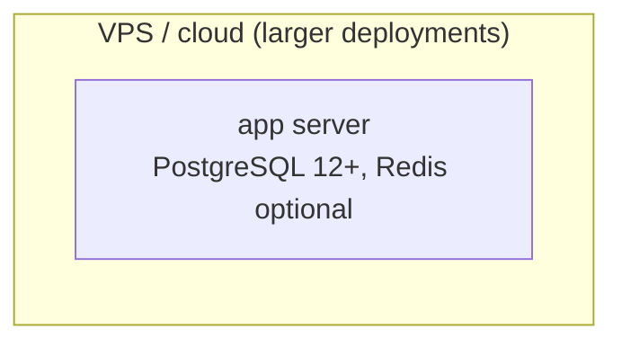

# Architecture Spine Review — Rubric Walker

**Target:** `ARCHITECTURE-SPINE.md` (NDAS, 2026-10-01)
**Scope of this pass:** coverage, diagram validity, internal consistency, scope discipline, deferred-section quality. Per instructions, version numbers and code-vs-spine mismatches already covered by other reviewers are not re-verified here.

## Verdict: PASS WITH NOTES

---

## 1. Coverage

### 1.1 CRITICAL — AD-15 asserts a deployment-isolation guarantee the spine's own cited source documents as currently broken, and the spine is silent on it

AD-15's rule states: "each cPanel domain (demo/live) keeps its own full app root, venv, `.env`, and `db.sqlite3` — **never a shared checkout**."

`DEPLOYMENT.md` (listed in the spine's own `sources:` front-matter) explicitly flags, in a visible warning block (§1.0), that this guarantee is currently undermined:

> `db.sqlite3` is currently committed to this git repository... a `git pull` in either app root pulls whatever `db.sqlite3` is in the repo's history, which can conflict with or overwrite that domain's live patient data. This must be fixed at the repo level... `passenger_wsgi.py` has the same... problem.

I verified this is not stale: `git ls-files` confirms both `db.sqlite3` and `passenger_wsgi.py` are tracked in the repo today, alongside a separate `db backup/db.sqlite3`. This means the project is currently carrying **patient data in git history**, which is both a live violation of AD-15's stated invariant and an unaddressed data-protection concern at the initiative altitude — exactly the kind of "silent" gap this checklist asks to flag.

The spine should do one of: (a) add an explicit sub-rule to AD-15 acknowledging the current violation and stating the fix path (`git rm --cached`, `.gitignore`, history scrub), or (b) add it to Deferred as an open, tracked remediation item with urgency noted (it is not a "nice to formalize later" item like CI or Postgres pinning — it is active patient-data exposure in VCS history). As written, AD-15 reads as if the invariant already holds, which is false on the day the spine was authored.

### 1.2 Minor — Email/notification delivery path is unaddressed

`settings.py` configures a real SMTP email path (`EMAIL_BACKEND`, `EMAIL_VERIFICATION_REQUIRED`, etc.) used at minimum for user email verification, and presumably future-usable by other apps (e.g., referral notifications, which AD-11 already governs for in-app `Notification` rows but not for any outbound email). There's no AD or convention row saying whether "send email" is a choke-point pattern (one shared helper) or an open free-for-all per app. Given AD-7/AD-8's precedent of centralizing other cross-cutting I/O (sanitization, file upload), this is a plausible future divergence point (one app composing raw `send_mail()` calls, another building a template-based helper) that the spine doesn't decide. Low severity since no second app currently sends email, but worth a one-line Deferred entry or AD extension if a second email-sending feature is anticipated soon.

### 1.3 Deployment/ops section is otherwise adequate

Logging split (django.log vs security.log), secrets handling (python-decouple), DB engine portability (AD-15), CSP/security headers (AD-13 + settings), and the two hosting shapes are all represented at an appropriate altitude. Caching/session backend (Redis optional vs LocMem) is covered in the Stack table. This is a reasonably complete envelope apart from 1.1/1.2 above.

---

## 2. Diagrams

All three mermaid blocks are syntactically valid (checked by hand: bracket/quote pairing, valid `graph TD`/`graph LR`/`erDiagram` directive usage, valid `||--o{` cardinality tokens, no reserved-word collisions).

### 2.1 Minor — Deployment topology diagram's VPS half is a floating, disconnected node

`vpsapp` has zero edges — nothing connects it to a web-serving node, a DB node, or anything else, unlike the cPanel half which shows `demo -->|Passenger WSGI| webdemo` and `live -->|Passenger WSGI| weblive`. The cPanel half conveys real topology (app root → Passenger → static/media doc root); the VPS half conveys only a labeled box. This isn't empty/placeholder text, but it is asymmetric enough to read as an afterthought relative to the cPanel half, and a reader can't tell from the diagram how the VPS shape actually serves static/media or whether Redis/Postgres are separate services or co-located. Consider at least one edge (e.g., `vpsapp -->|nginx/gunicorn| vpsweb[("static + media")]`) to bring it to parity.

### 2.2 Dependency graph and ERD: real content, no issues

The dependency graph's edges match the Structural Seed's app list and look like genuine (not placeholder) dependency claims — notably `users` has no edge to `patients`, which is a real and plausible architectural fact, not an omission artifact. The ERD covers 9 entities with directionally sensible cardinalities and isn't a toy/stub diagram.

### 2.3 Minor — ERD omits the `Notification` entity that AD-11 names as a first-class rule subject

AD-11's rule revolves entirely around `Notification` row creation discipline, but `Notification` doesn't appear in the ERD at all (only `REFERRALSENT`/`REFERRALRECEIVED` do). Given the ERD already models `referral`-adjacent entities, leaving out the one entity an AD specifically polices is a minor completeness gap — not required, but it's the kind of detail that would make AD-11 easier to cross-check visually.

---

## 3. Internal consistency

No direct contradictions found between the Consistency Conventions table, the Stack table, and the AD list.

### 3.1 Minor — Consistency Conventions table silently introduces a rate-limit rule not covered by any AD

The table's third row states "5/min login" as a rate tier. AD-5 (the only AD governing rate limits) only binds "create/edit endpoints carry a 10/m ratelimit, delete endpoints 5/m" — login is not mentioned there at all. The convention table is introducing a security-relevant invariant (brute-force throttling) that has no corresponding AD "Binds/Prevents/Rule" treatment, even though it's exactly the shape of thing AD-5 already exists to own. This reads as the login-rate-limit rule being added to the "seed" layer instead of the "AD" layer — see also finding 4.1 below, which is the structural version of this same issue.

No duplicate or near-duplicate ADs were found; AD-9 and AD-10 are complementary (query-level vs path-level institution scoping) rather than redundant, and AD-7 cleanly covers both sanitization and export-escaping as one choke-point family.

---

## 4. Scope discipline (seed content doing an AD's job)

### 4.1 Moderate — The "State & cross-cutting" convention-table row bundles several real invariants that read like under-specified ADs

Row 3 of the Consistency Conventions table packs in: the `@login_required` auth pattern, three separate rate-limit tiers (10/5/5), the django.log/security.log split, and "all secrets/env-dependent values via `python-decouple`, never hardcoded." Each of these has real prevention value in the same sense the existing ADs do:
- "secrets never hardcoded" prevents credential leaks into source control — directly analogous in severity to the db.sqlite3-in-git issue found in 1.1, and arguably deserves the same Binds/Prevents/Rule treatment other security invariants (AD-7, AD-8, AD-13) get, rather than a single prose clause in a table cell.
- The login rate limit (3.1 above) is scoped identically to AD-5's existing create/edit/delete tiers but lives outside AD-5's Binds.

This is the "quiet undocumented invariant in prose" pattern the review checklist calls out. None of these need to balloon into new standalone ADs, but at minimum the login-rate-limit figure belongs inside AD-5's Rule clause (it's the same mechanism, same file, same decorator), and the secrets-handling rule is a reasonable candidate for folding into AD-13 (which already owns `ndas/settings.py`-level security invariants) rather than living only as a table cell with no Prevents/Rule framing.

### 4.2 No other scope-discipline issues

The rest of the Structural Seed (directory tree, Stack table, Design Paradigm prose) stays descriptive and doesn't try to smuggle in prescriptive rules — those are correctly pushed into the numbered ADs.

---

## 5. Deferred section quality

All six Deferred items read as genuinely deferrable future work or open investigations, not disguised invariants:
- Celery/task-queue ambiguity — genuine unresolved fact-finding (dependency chain present, no code), correctly flagged as "don't build against an assumed queue."
- Postgres driver pinning — a concrete, bounded future task tied to a trigger event (next VPS deployment), not an invariant.
- Stale brownfield docs — a known-stale-docs cleanup task, correctly routed to another skill (`bmad-project-context`).
- Feature-level data model/UX detail — correctly out of altitude by definition.
- Formal test framework/CI — correctly routed to `bmad-testarch-*`.
- Institution onboarding workflow — correctly scoped as feature-level, consistent with AD-9/AD-10 already covering the structural half (scoping/paths).

None of the six are secretly invariants masquerading as tasks. The one item that *should* arguably be added to this section — the db.sqlite3/passenger_wsgi.py git-tracking issue — is currently **absent**, not miscategorized (see 1.1). That is a coverage gap, not a deferred-section quality problem per se, but it's the most actionable fix coming out of this review: add it here (or to AD-15 directly) with appropriate urgency framing, since unlike the other six items it represents an active risk rather than a future nice-to-have.

---

## Summary of Findings by Severity

| # | Severity | Finding |
|---|----------|---------|
| 1.1 | **Critical** | AD-15 asserts per-domain `db.sqlite3`/checkout isolation; `DEPLOYMENT.md` (a spine source) documents this as currently violated — both files are tracked in git today, meaning patient-data exposure in VCS history is live and the spine is silent on it. |
| 4.1 | Moderate | Consistency Conventions table row 3 bundles real security invariants (secrets-never-hardcoded, login rate limit) that have Prevents-level severity but no AD Binds/Prevents/Rule treatment — prose doing an AD's job. |
| 2.1 | Minor | Deployment topology diagram's VPS subgraph is a disconnected single node with no edges, asymmetric with the fleshed-out cPanel half. |
| 1.2 | Minor | Email/notification delivery path (SMTP, verification emails) has no choke-point convention despite the spine's precedent of centralizing other cross-cutting I/O. |
| 3.1 / 2.3 | Minor | Login rate limit and `Notification` entity each appear in one place (convention table / AD-11 text) but are missing from their natural counterpart (AD-5's Rule / the ERD). |

**Overall:** the spine is well-formed and the fifteen ADs are a defensible invariant set. The one finding that changes the verdict from a clean PASS is 1.1 — a currently-true, source-documented violation of a stated AD that the spine doesn't acknowledge. Everything else is tightening, not a blocker.
