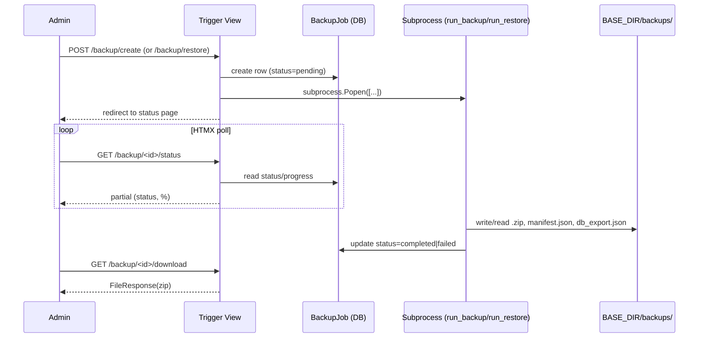

# Architecture Spine — Backup & Restore (Institutional/Super Admin)

> **Standing sequencing note:** `architecture.md`'s Implementation Handoff names Phase 2 stabilisation as the "First Implementation Priority" and states "no new development until Phase 2 is production-ready." This spine does not override that gate — it documents the design so it's ready whenever the team decides to build it, whether that's now or after Phase 2 stabilisation completes.

## Design Paradigm

**Async request-reply via detached subprocess.** A trigger view never does the work itself — it creates a job record, launches a detached OS process running a Django management command, and returns immediately; the browser polls the job record for status (the same idiom the existing notification bell already uses). No task queue, no broker, no new long-running service.

Layers, mapped to the new `backup/` app:

- **View layer** (`backup/views.py`) — trigger, status, list/history, download, restore-upload. Thin: permission check → delegate → redirect/render.
- **Service layer** (`backup/services.py`) — scoped serialization, zip assembly, manifest/checksum generation, restore application. Framework-agnostic Python; no HTTP concerns.
- **Job execution layer** (`backup/management/commands/run_backup.py`, `run_restore.py`) — the actual long-running work; owns all `BackupJob` status transitions.
- **Model layer** (`backup/models.py`) — `BackupJob`, `BackupRetentionPolicy`.
- **Reused, not reinvented:** `institution/` tenant-scoping, `ndas/custom_codes` validators/sanitization, the `FileResponse` download pattern from `institution/views.py`.

## Invariants & Rules

### AD-1 — New `backup/` app, one-app-per-domain convention `[ADOPTED]`

- **Binds:** all
- **Prevents:** backup logic scattered across `institution/` (already carrying full Phase 2 scope) or another unrelated app
- **Rule:** create a top-level `backup/` app (`models.py`, `views.py`, `services.py`, `management/commands/run_backup.py`, `management/commands/run_restore.py`, `urls.py`, `templates/backup/`, `tests/`); register in `INSTALLED_APPS` after `institution` (depends on `Institution` and the `get_institution_*_path` helpers); mount its URLs under `/backup/`. Both `BackupJob` and `BackupRetentionPolicy` inherit `TimeStampedModel` + `UserTrackingMixin` per the project's mandatory model pattern — this is what makes AD-8's audit trail work structurally rather than by parsing log files. `BackupJob` creation and `backup/services.py`'s trigger-level functions may only be called from `backup/views.py` — this is the single entry point; another app needing a backup/restore entry point (e.g. a "Quick Backup" button on the institution dashboard) must link to `backup/`'s own views, never import `services.py` directly, so rate limiting, permission checks, and audit logging can't be independently forgotten by a second code path.

### AD-2 — Async execution: detached subprocess, not Celery

- **Binds:** CAP-5
- **Prevents:** two implementers reaching for incompatible async approaches (Celery vs. threading); a synchronous view exceeding Gunicorn's 300s timeout on a multi-GB job
- **Rule:** a trigger view's work is limited to permission check → job-mutex check (AD-16) → create `BackupJob` row → launch `subprocess.Popen([sys.executable, <path-to-manage.py>, "run_backup"|"run_restore", str(job_id)])` → redirect to the status page, all within normal request time. The subprocess command is always `[sys.executable, manage.py, ...]`, never a shell script or OS-specific invocation, so it runs identically on Windows dev and Linux prod. The child must actually survive the launching Gunicorn worker's lifecycle: `start_new_session=True` on POSIX, `creationflags=subprocess.DETACHED_PROCESS | subprocess.CREATE_NEW_PROCESS_GROUP` on Windows — without these the child shares the worker's process group and can be torn down when that worker is recycled/restarted mid-job. `stdout`/`stderr` are redirected to a log file (`BASE_DIR/backups/<job_id>/job.log`), never left as `PIPE` (deadlocks once the OS pipe buffer fills on a long-running, chatty process) and never simply inherited by accident. If `Popen` itself raises before the command process starts, the trigger view — not the (nonexistent) command process — is responsible for writing `BackupJob.status="failed"` with a descriptive `error_message`; this is the one explicit exception to AD-8's "only the command process writes status" rule.

### AD-3 — DB export via `serializers`, scoped per-model by its actual FK path to institution — CORRECTED, see memlog

- **Binds:** CAP-1, CAP-2
- **Prevents:** cross-institution PHI leakage from assuming a uniform scoping mechanism that doesn't actually exist for most exported models
- **Rule:** `backup/services.py` streams the whole DB export into a single `db_export.json` inside the open `zipfile.ZipFile` handle (never buffering the full export in memory — see AD-13; see AD-5 for the file's shape). It processes one model's queryset at a time, in the fixed dependency order below, writing each record individually as it's read from `.iterator()` rather than accumulating a per-model list — so the no-full-buffering discipline holds per-record, not just per-model.

  **Institution scope resolution (feeds every bullet below and AD-18):** the trigger view resolves one `institution_scope` for the job before any querying starts — a single institution (institutional admin, or a super admin who picked exactly one) uses `for_institution(inst)`; a super admin's **explicit multi-institution subset** uses `.filter(institution__in=selected_institutions)` directly (`for_institution` itself only accepts one institution or `None` — it cannot express "these three," so a subset selection is never routed through it); a super admin's **system-wide** choice uses `all_institutions()` (unfiltered). Every per-model filter below substitutes whichever of these three the job resolved to.

  Each queryset is scoped to the target institution(s) via the FK path that *actually* reaches `Institution` for that specific model — verified against the real model files, not assumed uniform:
  - `Patient` — via `PatientManager` (`InstitutionScopedManager`, using whichever of the three scope forms above applies)
  - `referral` app's 3 models — via `InstitutionScopedManager`, same three scope forms. **Excluded from AD-18/AD-19's date-scoped cascade entirely, all 3 as a set** — `ReferralReceived` and `ReferralMessage` deliberately carry no `patient` FK (self-contained, cross-institution-independent by design — verified in `referral/models.py`); `ReferralSent` does have a `patient` FK but is excluded alongside them anyway, since a date-scoped cascade that pulled `ReferralSent` alone while leaving its paired `ReferralReceived`/`ReferralMessage` behind would split one referral thread across two archive types. SPEC.md's cross-institution-merging non-goal already rules out treating referrals as a per-patient cascade unit. A date-scoped archive never includes or restores referral data; only a full-scope (undated) archive does.
  - `Video`, `Attachment`, `GMAssessment`, `HINEAssessment`, `DevelopmentalAssessment`, `CDICRecord`, `GeneralPaediatricAssessment`, `Problem` — **no scoped manager exists**; each is Django's plain default manager, scoped explicitly via `.filter(patient__institution=institution)` (or `patient__institution__in=...` / no filter, per the resolved scope form). `CDICRecord` and `GeneralPaediatricAssessment` both carry a direct `patient` FK (verified in `patients/models.py`) and were missing from this list in the original pass — corrected here.
  - `ProblemAction` — scoped via `.filter(problem__patient__institution=institution)` (or the `__in=...` / unfiltered equivalent)

  **Known gap, not fixed by this pass:** `Bookmark` references a patient-scoped object generically (`bookmark_type` + `object_id`, not a direct FK — see `patients/models.py`'s `Bookmark.MODEL_MAPPING`) and is excluded from both full-scope and date-scoped export/restore. This predates this update (the original AD-3 never covered it either); flagged under Deferred rather than silently dropped.

  When a date/date-range filter is supplied, the per-model institution-only filters above are replaced by AD-18's patient-cascade filters instead — see AD-18.

  `dumpdata`/`loaddata` management commands are never invoked directly (they cannot be scoped at all).

  **Restore semantics (applies inside `run_restore.py`) — FULL-SCOPE archives only (no date filter):** restore is delete-scoped-then-reload, never a merge. For each model, in the fixed dependency order — `Patient` first; then `Video`, `Attachment`, `GMAssessment`, `HINEAssessment`, `DevelopmentalAssessment`, `CDICRecord`, `GeneralPaediatricAssessment`, `Problem`; then `ProblemAction` last — inside one transaction per model: delete existing rows matching the archive's institution scope, then `deserialize()` and save the archive's rows for that model with their original PKs preserved. Deleting before recreating with the same PKs avoids the auto-increment sequence collision that preserving explicit PKs alongside live auto-increment inserts would otherwise risk. `Institution` rows themselves are never recreated by restore — the target institution(s) must already exist in the destination DB (matched by slug), since restore always runs against the same live system, never a fresh empty database. **A date-scoped (partial) archive instead follows AD-19's additive, PK-remapped restore path — the two are mutually exclusive per archive, selected by `manifest.json`'s `date_filter.applied` flag.**

### AD-4 — Non-public storage location

- **Binds:** CAP-1, CAP-2, CAP-3, Constraints (no public path)
- **Prevents:** an unencrypted PHI archive becoming reachable via WhiteNoise static serving or the existing media path
- **Rule:** backups are written to `BASE_DIR/backups/<job_id>/`, never under `MEDIA_ROOT` or `STATIC_ROOT`. No URLconf or webserver config exposes this directory directly — only AD-7's gated view reads from it.

### AD-5 — Archive internal layout — AMENDED: single JSON file, see memlog

- **Binds:** CAP-1, CAP-2
- **Prevents:** backup-writer and restore-reader code drifting on where each piece lives; the per-model file sprawl SPEC.md now explicitly forbids
- **Rule:** zip root holds `manifest.json`; a single `db_export.json`; `media/{institution_slug}/videos/...` and `media/{institution_slug}/attachments/...`, mirroring `get_institution_video_path`/`get_institution_attachment_path` verbatim. `db_export.json` is one JSON object keyed by `"<app_label>.<model_name>"` (e.g. `"patients.patient"`, `"video.video"`), each value a JSON array of that model's records in the same per-object shape `django.core.serializers` already produces (`{model, pk, fields}`) — see AD-3 for how it's streamed without buffering the whole thing in memory. **Every model in AD-3's dependency-ordered list is always present as a key, even when its array is empty (`[]`)** — a key is never omitted for zero matches, so a reader never has to treat "key absent" and "key present with an empty array" as the same thing. No institution-namespaced path or row-level institution tag is needed inside the JSON for a **full-scope** archive: restore is whole-archive and atomic to the exact scope the backup was created for (SPEC.md's non-goal rules out cross-institution merging). A **date-scoped** archive instead relies on each record's own `fields.patient` (or `fields.problem`-chain) value to determine patient ownership during AD-19's restore — no separate tagging needed there either, since that FK is already part of the serialized record. Per-institution `record_counts` in the manifest (AD-6) are computed via separate scoped `COUNT` queries at backup-creation time, independent of this file layout.

### AD-6 — Manifest schema

- **Binds:** CAP-2
- **Prevents:** backup-writer and restore-validator code disagreeing on what the manifest carries
- **Rule:** `manifest.json` = `{source_job_id, schema_version, institutions: [...], record_counts: {model: count}, checksums: {path: sha256}, generated_at, generated_by, date_filter: {applied: bool, start: date|null, end: date|null, field: "patient.created_at"}}`. `date_filter.applied=false` (with `start`/`end` null) marks a full-scope archive; `run_restore.py` reads this single flag to choose AD-3's delete-then-reload path or AD-19's additive/PK-remap path — it is never inferred from record counts or any other heuristic. `source_job_id` is the originating `BackupJob`'s id, so restore can look up that row's `archive_checksum` (see below) to confirm the uploaded file is an authentic, unmodified export from this system rather than an arbitrary external file.
  - `schema_version` is a single SHA-256 hex string over the sorted `"app_label.migration_name"` tuples from `MigrationRecorder.applied_migrations()`. Comparison on restore is **exact equality** — any difference between the archive's `schema_version` and the target DB's current one rejects the restore with a clear "schema mismatch" error naming both hashes. This is the conservative default (matches the project's boring-technology bias); a looser superset/per-app-relevant comparison can be adopted later via a `bmad-spec` update if exact equality proves too brittle in practice.
  - `checksums` dict keys are forward-slash, POSIX-style paths relative to the zip root, exactly matching `zipfile.ZipFile.namelist()` output — regardless of the OS the archive was built on (a Windows-built archive using backslash keys would silently break every lookup on restore).
  - `manifest.json` cannot check its own integrity by embedding a hash of itself (chicken-and-egg). Instead, the whole-archive integrity check lives outside the zip entirely: after the `.zip` is finalized, its SHA-256 is computed and stored in `BackupJob.archive_checksum` (a DB field — trusted, not user-controlled). Restore verifies the uploaded `.zip`'s hash against the corresponding `BackupJob.archive_checksum` before opening it, then verifies each per-file checksum from `manifest.json` before applying that file's contents.

### AD-7 — Download/restore-upload reuses the existing `FileResponse` pattern

- **Binds:** CAP-1, CAP-3, CAP-6
- **Prevents:** a second, inconsistent file-serving mechanism when a reviewed precedent already exists in this codebase
- **Rule:** download view returns `FileResponse(open(path, "rb"), content_type="application/zip")` + `Content-Disposition: attachment`, from a permission-checked view — identical shape to `institution/views.py`'s superadmin Excel export. The view first requires `BackupJob.status == "completed"` (`get_object_or_404(BackupJob, id=pk, status="completed")`); a `pending`/`running`/`failed` job, or a `.zip` that has vanished from disk (e.g. pruned between the list rendering and this request), returns a specific "backup not available" error — never an unhandled exception, and never a partial/corrupt file served as if it were valid. Restore view accepts a standard `forms.FileField` upload.

### AD-8 — Progress via `BackupJob` + HTMX polling

- **Binds:** CAP-5
- **Prevents:** introducing WebSockets, which architecture.md's API & Communication Patterns table already rules out
- **Rule:** `BackupJob(job_type: backup|restore|pre_restore_snapshot, status: pending|running|completed|failed, progress_pct, archive_checksum, error_message, created_at, updated_at, completed_at, triggered_by, scope: Institution FK, nullable — null means system-wide)`. `triggered_by` is set explicitly by the view (`request.user`) at row creation, matching the real, code-verified pattern used everywhere else in this codebase (`referral/views.py`, `video/views.py` both set `added_by` manually) — not an automatic middleware behavior, despite how CLAUDE.md's shorthand describes `UserTrackingMixin`. `status` is the sole authoritative "done" signal: the terminal `progress_pct=100` write and `status="completed"` write happen together in one `.save(update_fields=[...])` call, never as two separate saves — a consumer must never treat `progress_pct` alone as a completion signal. A status-page partial is polled via HTMX using the same polling idiom as the notification bell (shorter interval than the bell's 60s is fine — this is an actively-watched job, not a passive badge). On completion or failure, `run_backup.py`/`run_restore.py` also creates a row in the existing `referral` app's `Notification` model, so CAP-5's "be notified" is satisfied even if the admin has navigated away from the status page — reusing the bell's existing 60s poll rather than inventing a second notification channel.

### AD-9 — Retention pruning is lazy/on-access; no scheduler

- **Binds:** CAP-6
- **Prevents:** a second implementer adding a cron entry or Celery-beat schedule, introducing periodic-execution infrastructure this project has nowhere else
- **Rule:** policy lives in a single-row `BackupRetentionPolicy` model (`enabled: bool = False`, `max_age_days: int`), editable by super admin only. The prune sweep runs **only** when a **super admin** loads a backup-list view (never on an institutional admin's page load — an institutional admin must never trigger deletion of data outside their own scope). When it runs, the delete query is system-wide (matching CAP-6's "system-wide... policy"), but excludes: any `pre_restore_snapshot` row (AD-14 — never auto-pruned), and any backup that is the source of a `BackupJob` currently `pending` or `running` (an in-progress restore or snapshot reading it). Age is measured from `completed_at`, not `created_at` — a `pending`/`running` row can never be "old" in the pruning sense. The prune action is logged as a system-attributed entry ("system: pruned N backups older than {max_age_days}d"), not fabricated as any individual user's `triggered_by`. No OS cron entry, no Celery beat.

### AD-10 — Authorization boundary

- **Binds:** CAP-3, CAP-4, all
- **Prevents:** a parallel permission mechanism diverging from Phase 2's canonical institution-scoping
- **Rule:** every backup/restore view reuses `institution/`'s existing tenant-scoping (`middleware.py`, `context_processors.py`); restore views additionally require an explicit super-admin-only check on top of that, per the existing `UserType` role-check convention.

### AD-11 — Rate limiting and upload trust boundary

- **Binds:** CAP-1, CAP-3, Constraints
- **Prevents:** trigger-endpoint abuse; a restore upload treated as pre-trusted because "an admin uploaded it"
- **Rule:** backup/restore trigger endpoints carry `@ratelimit(key="user_or_ip", ...)` per the existing `django_ratelimit` convention. An uploaded restore `.zip` passes the `python-magic` MIME check used for every other upload, then AD-6's manifest/checksum validation — both before any content is trusted or applied.

### AD-12 — No encryption; storage-path + auth is the sole compensating control `[ADOPTED — from SPEC.md non-goal]`

- **Binds:** CAP-1, CAP-2, CAP-3
- **Prevents:** a later ad-hoc/partial encryption addition that silently breaks the human-browsability requirement without a spec update
- **Rule:** archives are stored and transmitted unencrypted. AD-4 (non-public path) + AD-10 (auth boundary) are the complete PHI protection for this feature. Any future encryption requirement goes back through `bmad-spec` first — it is not a local implementation choice.

### AD-13 — Streaming/chunked I/O, no in-memory buffering of a full archive

- **Binds:** CAP-1, CAP-2, CAP-3, Constraints (streaming, no size cap)
- **Prevents:** a naive implementation that builds the whole DB export or copies whole media files into memory before writing, which breaks on a large institution's dataset
- **Rule:** DB export (AD-3) writes each model's serialized JSON directly into an open `zipfile.ZipFile` handle, one model at a time. Media files are copied into the zip via chunked `shutil.copyfileobj(src, dst, length=<bounded buffer>)`, never `read()` in one call. The same discipline applies in reverse on restore (`run_restore.py` reads the zip entry-by-entry, never extracts-then-loads the whole archive into memory).

### AD-14 — Pre-restore snapshot reuses the CAP-1 backup mechanism

- **Binds:** CAP-3
- **Prevents:** a second, bespoke snapshot/rollback format that duplicates what backup creation already does, and the ambiguity of "return to prior state" having no concrete implementation
- **Rule:** `run_restore.py`'s first step is to call the same backup service AD-3/AD-5 define to create a normal backup of current state (`job_type="pre_restore_snapshot"`), stored in `BASE_DIR/backups/` like any other backup, linked via `BackupJob.pre_restore_snapshot` (self-referential FK) before any restore changes are applied. "Returning to prior state" (SPEC.md CAP-3) means the super admin restores from that snapshot through the ordinary restore flow — no separate snapshot format, no separate rollback code path. Unlike an ordinary backup, a `pre_restore_snapshot` row is **exempt from AD-9's age-based auto-pruning entirely** — it is the one rollback path for a restore, and is only ever removed via AD-15's manual super-admin delete once they're confident it's no longer needed. Visibility follows AD-10's restore-is-super-admin-only rule: only super admins see or download pre-restore snapshots.

### AD-15 — Manual per-backup deletion

- **Binds:** CAP-6
- **Prevents:** SPEC.md's explicit "delete individual backups" capability going unimplemented because only policy-driven auto-prune (AD-9) was specified
- **Rule:** `backup/views.py` has a dedicated delete view, permission-gated per scope (institutional admin: only their own institution's backups; super admin: any), which removes both the `.zip` from `BASE_DIR/backups/` and the `BackupJob` row. Distinct from AD-9's automatic age-based pruning.

### AD-16 — Job-level concurrency lock (restore-vs-live-writes: accepted residual risk, user-confirmed)

- **Binds:** CAP-3, CAP-5
- **Prevents:** two backup/restore jobs for the same scope running at once and racing on the same institution's files/rows
- **Rule:** the trigger view refuses to start a new backup/restore job if a `BackupJob` for the same `scope` is already `pending` or `running` — checked as part of AD-2's trigger-view sequence, before creating the new row. This does **not** guard against an ordinary clinician's live save on the same records colliding with an in-progress restore (a stronger system-wide maintenance-mode gate was considered and explicitly declined — accepted as a residual risk given restores are rare, admin-triggered, and relatively brief; revisit only if real incidents show this matters in practice).

### AD-17 — Disk-capacity check before starting a job

- **Binds:** CAP-1, CAP-3
- **Prevents:** a job failing mid-write because the disk filled, leaving a partial/corrupt archive or a half-restored database
- **Rule:** before launching the subprocess, the trigger view checks `shutil.disk_usage(BASE_DIR)` against a safety margin (an estimated job size × 1.2, falling back to a flat minimum-free-space guard if estimation isn't feasible). Insufficient space refuses to start the job at all and sets `BackupJob.status="failed"` immediately with a clear error, rather than failing partway through a multi-GB write.

### AD-18 — Date-scoped export: patient-anchored cascade query

- **Binds:** CAP-1, CAP-2
- **Prevents:** an ad hoc per-model date filter that produces a referentially incomplete patient (e.g. a Video row with no corresponding Patient row in the archive)
- **Rule:** when the trigger view supplies a date or date range, `backup/services.py` first resolves `patient_qs` starting from AD-3's `institution_scope` resolution (single / explicit multi-institution `__in` / system-wide — never routed through `for_institution` for a multi-institution subset) and narrows it with `.filter(created_at__date__range=(start, end))` (a single date is `start == end`). Every other in-scope model is then filtered **relative to `patient_qs`, not by institution or its own date**: `Video`, `Attachment`, `GMAssessment`, `HINEAssessment`, `DevelopmentalAssessment`, `CDICRecord`, `GeneralPaediatricAssessment`, `Problem` via `.filter(patient__in=patient_qs)`; `ProblemAction` via `.filter(problem__patient__in=patient_qs)`. `referral` app models are never part of this cascade — see AD-3's exclusion note. This guarantees every related record of a patient created in the window is included in full regardless of that related record's own timestamp, and nothing outside the patient's own related set leaks in. When no date filter is supplied, AD-3's original institution-only filters apply unchanged (full scope) and this AD does not engage. The manifest's `record_counts` (AD-6) are computed against these same, possibly narrowed, querysets.

### AD-19 — Date-scoped (partial) restore: additive import with PK remapping, skip-in-full on patient conflict

- **Binds:** CAP-3
- **Prevents:** a naive restore that reuses AD-3's delete-then-reload semantics on a partial archive (which would wrongly wipe out the target institution's data outside the archive's date window); blindly reinserting archived PKs into a target DB where that PK space is already in live use by unrelated records; and the specific FK-remap omissions a reviewer pass caught in an earlier draft of this AD (`video_file`, `institution`, the `CustomUser` audit FKs)
- **Rule:** `run_restore.py` branches on `manifest.json`'s `date_filter.applied` flag (AD-6). When `true`:
  1. **Match — fully resolves the outcome for every archived patient before anything is previewed or applied.** Read the `"patients.patient"` array from `db_export.json`. For each archived patient record, in order:
     - **Institution resolution first.** Resolve the archived record's source institution to the **target** `Institution` row sharing the same slug. If no institution with that slug exists in the target system, this patient is excluded up front (missing-institution error) and never reaches identity matching — it cannot be skip, import, or ambiguous.
     - **Identity match.** For every remaining patient, attempt to match an existing target-DB patient by checking **all five** of `bht`, `nnc_no`, `ptc_no`, `pc_no`, `pin` that record has populated against the corresponding fields on existing target patients (all five are unique-if-set on `Patient` but nullable — see `patients/models.py`) — a match on **any** populated field is a conflict, not just the first one found. A record with **none** of the five set cannot be matched and is always treated as new (accepted residual risk of an eventual duplicate for identifier-less patients — the same accepted-residual-risk pattern as AD-16; flagged to the user, not silently absorbed).
     - **Ambiguous match guard.** If an archived patient's populated identifiers match more than one distinct target patient, or if two different archived patients in the same archive both match the same target patient, neither side of that ambiguity is resolved by guessing — the affected archived patient(s) are excluded (not skipped-as-existing, not imported-as-new) and reported as an ambiguous-conflict error.
     - Every archived patient now has exactly one final, immutable outcome: **skip** (identity-matched), **import** (unmatched, valid target institution resolved), or **excluded** (missing-institution or ambiguous-conflict). Nothing later in this process changes that outcome — this is what makes the preview in step 2 a true preview.
  2. **Partition & preview.** The restore preview shown to the super admin before confirmation lists exactly the skip-set, import-set, and excluded set from step 1, with each excluded patient's reason (missing-institution / ambiguous-conflict). Confirming the preview applies precisely this partition — no patient can move between skip/import/excluded after this point.
  3. **Skip.** Every archived row belonging to a skip-set patient — the patient row itself and every row in another model's section whose `fields.patient` (or `fields.problem`-chain) equals that patient's archived PK — is left untouched. Never field-level merged, never overwritten. Its media files inside the archive's `media/` folder are correspondingly never extracted to disk — see the media-application note below. An excluded patient's data and media are likewise never extracted to disk, exactly like a skipped patient — the only difference is *why* nothing was applied.
  4. **Additive import with full FK remap**, one transaction **per import-set patient** (not one transaction for the whole archive — see rationale below), in the fixed dependency order AD-3 establishes (`Patient` first; then `Video`, `Attachment`, `GMAssessment`, `HINEAssessment`, `DevelopmentalAssessment`, `CDICRecord`, `GeneralPaediatricAssessment`, `Problem`; then `ProblemAction` last): deserialize each row with `pk=None` so the target DB assigns a fresh PK on save, then remap **every** FK field that points at another imported or pre-existing object before saving:
     - `patient` (all cascade models) and `problem` (`ProblemAction`) — remapped through this patient's in-memory source-PK→new-PK maps, built as each model's rows are inserted (same mechanism as before, now stated precisely).
     - `institution` (`Patient` only) — set to the target `Institution` row already resolved for this patient in step 1 (never copied verbatim as the archived PK). By this point every import-set patient is guaranteed to have a valid target institution — step 1 is the only place a missing-institution exclusion can happen.
     - `video_file` (`GMAssessment`, `OneToOneField`→`Video`) — remapped through the `Video` source-PK→new-PK map, exactly like `patient`/`problem`. `Video` is inserted before `GMAssessment` in the dependency order above specifically so this map is ready.
     - `added_by`, `last_edit_by` (every cascade model, via `UserTrackingMixin`) and `performed_by` (`ProblemAction`) — all FK→`CustomUser`, nullable with `on_delete=SET_NULL` (verified in `Custom_abstract_class.py` / `problemlist/models.py`): if a `CustomUser` with the archived PK still exists in the target system, preserve it as-is (the common case — export and restore usually target the same live system or a shared user base); otherwise set the field to `NULL` rather than fabricating attribution to an unrelated user (e.g. the admin running the restore).
     - Any `ManyToManyField` (e.g. `GMAssessment.diagnosis`→`DiagnosisList`) is treated as a reference to shared, migration-seeded lookup data assumed identical across source and target systems, and is preserved as-is, not remapped.
  - **Why one transaction per patient, not one for the whole archive:** patients in a date-scoped restore are independent units by construction (skip/import is already decided per patient) — a whole-archive transaction would hide progress from AD-8's polling until the very end and hold one long-lived transaction/lock (a real concern on SQLite's DB-wide write lock) for no benefit AD-16 doesn't already assume. Per-patient transactions mean `BackupJob.progress_pct` advances after each patient commits, and a failure importing one patient rolls back only that patient — patients already committed before it stay imported. A retried restore of the same archive then finds those already-imported patients present in the target and correctly skips them (step 1), so a partial failure is safely resumable, not corrupting.
  - `Institution` rows are never created by restore — step 1's missing-institution exclusion is what keeps that rule intact for a partial archive, same as AD-3's full-scope restore requiring the target institution(s) to already exist.
  - AD-14's pre-restore snapshot still runs before either restore path, including this one — defense-in-depth for a post-hoc "undo the whole restore" even though per-patient transactions already make each patient's import atomic on its own. For a date-scoped restore, that snapshot is always a **full-scope (undated)** backup of the target institution(s), never itself date-filtered — otherwise it couldn't fully reverse the additive import it's meant to guard against.
  - **Media application** mirrors the final, step-1-resolved partition, not a tentative one: only files referenced by an **import-set** patient's `Video`/`Attachment` rows (via each row's `fields.file` path) are copied from the archive's `media/` folder to disk, strictly after that patient's transaction commits. A **skip-set or excluded** patient's media entries inside the archive are never extracted, so no orphaned file is left on disk for a patient whose DB rows were never applied — this holds for both because step 1 finalizes every patient's outcome before any file, DB or media, is touched.



## Consistency Conventions

| Concern | Convention |
| --- | --- |
| Naming | `BackupJob`, `BackupRetentionPolicy` models; `run_backup`/`run_restore` management commands; templates `backup/manager.html` (history/list), `backup/create.html` (trigger), `backup/status.html`, `backup/restore.html` — matching the project's `manager/add/edit/view` naming pattern |
| Data & formats | Job PK is the job identifier passed to the subprocess; timestamps via `TimeStampedModel`; checksums are SHA-256 hex; `manifest.json` dates are ISO-8601 |
| State & mutation | Only the `run_backup`/`run_restore` command process writes `BackupJob` status transitions once the command process exists (`pending → running → completed/failed`) — **except** the trigger view itself, which is solely responsible for writing `status="failed"` if `subprocess.Popen` raises before that process ever starts (AD-2), since no other code could ever know that happened. Outside that one case, views are read-only on `BackupJob`. |
| Errors | `@handle_view_errors(...)` on every view, per existing convention |
| Audit trail | Split by action type, matching CAP-7's requirement to log creation, download, and restore: backup/restore **creation** is captured structurally via `BackupJob`'s `triggered_by`/`created_at` fields, set explicitly by the view (`request.user`) — the same manual pattern used everywhere else in this codebase (`referral/views.py`, `video/views.py`), not an automatic `UserActivityMiddleware` behavior despite how CLAUDE.md's shorthand describes `UserTrackingMixin`. **Download** has no natural model mutation to hang that off, so it is explicitly logged to `logs/security.log` via the existing logger convention (matches architecture.md's "security events to dedicated log" rule). A denied restore attempt also logs to `logs/security.log`. An AD-9 prune sweep logs a system-attributed entry, not any individual user's action |
| Auth | AD-10; no separate permission system |

## Stack

No new external dependencies. `zipfile`, `hashlib`, `subprocess`, and `django.core.serializers` are standard library / already part of Django 5.2. `python-magic` and `django-ratelimit` are already project dependencies, reused as-is.

## Structural Seed

```text
backup/
  models.py              # BackupJob, BackupRetentionPolicy
  views.py                # trigger, status, list, download, restore-upload
  services.py              # scoped serialization, zip assembly, manifest, restore apply
  urls.py
  management/
    commands/
      run_backup.py        # subprocess entry point
      run_restore.py        # subprocess entry point
  templates/backup/
    manager.html            # backup history/list
    create.html              # trigger form
    status.html               # polled status partial
    restore.html               # upload form
  tests/                     # package, never a bare tests.py (CLAUDE.md discovery-collision warning)

BASE_DIR/backups/<job_id>/     # non-public storage, outside MEDIA_ROOT/STATIC_ROOT
  <job_id>.zip
    manifest.json
    db_export.json           # single file, keyed by "<app_label>.<model_name>"
    media/{institution_slug}/videos/...
    media/{institution_slug}/attachments/...
```

## Capability → Architecture Map

| Capability | Lives in | Governed by |
| --- | --- | --- |
| CAP-1 (create backup) | `backup/services.py`, `run_backup.py` | AD-1, AD-2, AD-3, AD-4, AD-5, AD-10, AD-13, AD-17, AD-18 |
| CAP-2 (manifest & integrity) | `backup/services.py` | AD-5, AD-6, AD-13, AD-18 |
| CAP-3 (restore) | `backup/services.py`, `run_restore.py`, `backup/views.py` | AD-2, AD-3, AD-6, AD-7, AD-10, AD-11, AD-13, AD-14, AD-16, AD-17, AD-19 |
| CAP-4 (scoped access control) | `backup/views.py` | AD-10 |
| CAP-5 (async + progress) | `backup/models.py` (`BackupJob`), `run_backup.py`/`run_restore.py`, `backup/views.py` | AD-2, AD-8, AD-16 |
| CAP-6 (history, delete & retention) | `backup/views.py`, `backup/models.py` (`BackupRetentionPolicy`) | AD-7, AD-9, AD-15 |
| CAP-7 (audit logging) | `backup/models.py` (`BackupJob`), `logs/security.log` | AD-1, AD-8, Consistency Conventions (Audit trail) |

## Deferred

- **Encryption at rest** — excluded by SPEC.md non-goal (AD-12); revisit only via a `bmad-spec` update.
- **Offsite/cloud storage (S3/Azure)** — SPEC.md non-goal, Phase 2 candidate (see `professional-options.md`).
- **Scheduled/automatic backup or restore triggering** — SPEC.md non-goal.
- **Celery adoption** — reconsider only if job orchestration needs grow beyond what a detached subprocess + polling can reasonably handle (e.g. true multi-box scaling); not needed for this slice.
- **Stuck/orphaned `BackupJob` watchdog** — no monitoring infrastructure exists anywhere in this project yet (architecture.md names uptime monitoring as a Nice-to-Have Gap). Interim: the status page flags a job as stale if `updated_at` hasn't advanced in N minutes; a real reaper waits for project-wide monitoring.
- **Count-based retention dimension** — SPEC.md resolved age-only for v1; count-based (`keep last N`) is a future `BackupRetentionPolicy` field if ever needed.
- **Sandbox/preview restore environment** — SPEC.md resolved restore applies directly (with a pre-restore snapshot), no separate sandbox.
- **System-wide maintenance-mode / write-blocking during restore** — considered and explicitly declined (user-confirmed) in favor of AD-16's job-level lock alone. A restore can still race with an ordinary clinician's concurrent save on the same records; accepted as a residual risk given restores are rare, admin-triggered events. Revisit only if real incidents show this matters in practice.
- **Identifier-less patient on partial restore** — a `Patient` with none of `bht`/`nnc_no`/`ptc_no`/`pc_no`/`pin` set is always imported as new under AD-19 (cannot be conflict-matched), an accepted residual risk of an eventual duplicate; revisit with a fallback matching strategy (e.g. name + `dob_tob`) only if real incidents show this matters in practice.
- **Cascade model list is hand-maintained** — AD-18/AD-19's dependency-ordered model list (`Video`, `Attachment`, `GMAssessment`, `HINEAssessment`, `DevelopmentalAssessment`, `CDICRecord`, `GeneralPaediatricAssessment`, `Problem`, `ProblemAction`) must be updated by hand if a future model gains a direct or chained FK to `Patient`; nothing enforces this automatically today.
- **`Bookmark` is excluded from backup/restore entirely** — it references a patient-scoped object generically (`bookmark_type` + `object_id`, per `patients/models.py`'s `Bookmark.MODEL_MAPPING`), not via a direct FK the cascade/scoping mechanism in AD-3/AD-18/AD-19 can filter on. This predates this update — the original full-scope AD-3 never covered it either. Revisit only as a deliberate, separately-specced addition (resolving generic-relation lookups per `bookmark_type` is real design work, not a one-line fix).
- **Multi-institution query path is now explicit but unenforced** — AD-3/AD-18 name the three-way branch (`for_institution` / `.filter(institution__in=...)` / `all_institutions()`) a view must choose correctly; nothing stops a future call site from misusing `for_institution` with a list and silently getting Django's "expected an Institution instance" error, or worse, an unfiltered/unintended queryset. A thin `resolve_institution_scope(request)` helper in `backup/services.py` is the natural place to centralize this if a second call site for it appears.
- **`architecture.md`'s own Django-version claim is stale** — it states "Django 4.2.16" in four places; `requirements.txt` and `CLAUDE.md` both confirm the actual version is Django 5.2 LTS. This spine used the correct live version throughout rather than deferring to its companion doc, but the discrepancy in `architecture.md` itself is out of scope for this spine to fix — flagged for whoever owns that document.
