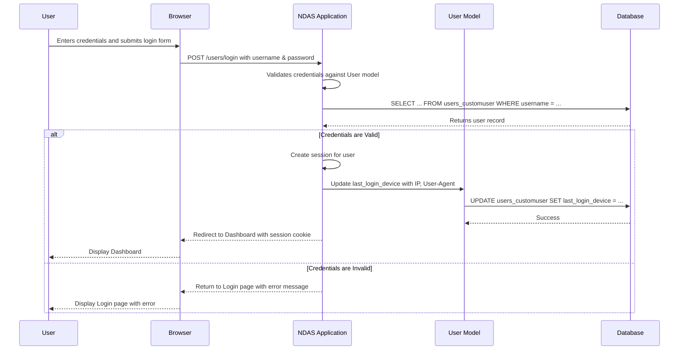

# NDAS Backend Architecture Document

## 1\. Introduction

This document outlines the overall project architecture for NDAS, including backend systems, shared services, and non-UI specific concerns. Its primary goal is to serve as the guiding architectural blueprint for AI-driven development, ensuring consistency and adherence to chosen patterns and technologies.

**Relationship to Frontend Architecture:**
If the project includes a significant user interface, a separate Frontend Architecture Document will detail the frontend-specific design and MUST be used in conjunction with this document. Core technology stack choices documented herein (see "Tech Stack") are definitive for the entire project, including any frontend components.

### Change Log

| Date | Version | Description | Author |
| --- | --- | --- | --- |
| 2025-08-19 | 1.0 | Initial architecture draft based on brownfield analysis | Winston |

### Starter Template or Existing Project

Based on the analysis of the existing codebase and the Brownfield Enhancement PRD, this project is not based on a specific starter template. It is an existing, standard Django application. The current structure and patterns will serve as the foundation for all enhancements, and all new architectural decisions will be made to align with and progressively refactor this existing structure.

-----

## 2\. High Level Architecture

### Technical Summary

The proposed architecture is a production-hardened monolithic Django application. The primary focus is on enhancing the existing structure by introducing robust security measures, significant performance optimizations, and increased stability. Key components include a Django backend handling all business logic, a transition to a PostgreSQL database for reliable data storage, and the use of WhiteNoise for efficient static file serving. This architecture directly supports the PRD goals by creating a secure, scalable, and maintainable foundation for the application's future growth.

### High Level Overview

  * **Architectural Style**: Monolithic
  * **Repository Structure**: Monorepo
  * **Service Architecture**: Single Django service organized into distinct apps (`users`, `patients`, `clinical_records`).
  * **Primary Data Flow**: User requests are handled by the Gunicorn server, routed through Django to the appropriate views, which interact with the database and render HTML templates.

### High Level Project Diagram

```mermaid
graph TD
    A[User's Browser] --> B{Gunicorn WSGI Server};
    B --> C[Django Application (NDAS)];
    C --> D[Database (PostgreSQL)];
    C --> E[Static & Media Files (WhiteNoise / File System)];
    C --> A;

    subgraph "Containerized Environment (Docker)"
        B
        C
    end
```

### Architectural and Design Patterns

  * **Monolithic Architecture**: Maintained for simplicity and focused enhancement efforts.
  * **Repository Pattern**: Adopted to abstract and centralize data access logic, improving performance and testability.
  * **Explicit Service Layer**: Introduced to separate business logic from request/response handling in views, leading to cleaner code.

-----

## 3\. Tech Stack

### Cloud Infrastructure

  * **Provider**: Standard cloud provider (e.g., AWS, Azure, Google Cloud).
  * **Key Services**: Virtual Private Server, Managed PostgreSQL Database, Managed Redis Instance, Object Storage.
  * **Deployment Regions**: To be determined based on user location.

### Technology Stack Table

| Category | Technology | Version | Purpose | Rationale |
| :--- | :--- | :--- | :--- | :--- |
| **Runtime** | Python | 3.10 | Core application language | Stability and consistency with existing setup. |
| **Framework** | Django | 4.2.16 | Web framework | Use of the latest security-patched version of the existing framework. |
| **WSGI Server** | Gunicorn | 23.0.0 | Serves the Django application | Industry standard for deploying Python web applications. |
| **Database**| **PostgreSQL**| 13+ | Production-grade relational database | **CRITICAL CHANGE**: Mitigates security and performance risks of SQLite. |
| **Caching** | **Redis** | 5.0+ | In-memory cache | **NEW ADDITION**: Improves performance as recommended in the analysis. |
| **Static Files**| WhiteNoise | 6.9.0 | Serves static files efficiently | Current, effective solution for serving static assets. |
| **Login Tracking** | django-user-agents | 0.4.0 | Parses User-Agent strings | Leveraged for tracking user device types. |
| **Containerization**| Docker | Latest | Container runtime | Existing deployment method. |

-----

## 4\. Data Models

The data models will be extended to support new features and improve performance.

  * **`User` (extends `users.CustomUser`)**: Represents system users, extended for role-based access control and login auditing.
  * **`Patient` (based on `patients.Patient`)**: Central patient entity, with added database indexes for improved search performance.
  * **`ClinicalRecord` (New Model)**: Stores structured clinical records for general pediatric clinic visits.

-----

## 5\. Components

The application is structured into the following logical components:

  * **`users` (Django App)**: Manages user authentication, registration, password management, RBAC, and login auditing.
  * **`patients` (Django App)**: Core clinical component for managing patient data, assessments, videos, and attachments.
  * **`clinical_records` (New Django App)**: Manages structured records for general clinic visits.

### Component Diagram

```mermaid
graph TD
    subgraph "Django Monolith"
        A(users App)
        B(patients App)
        C(clinical_records App)
    end

    D[Database (PostgreSQL)]
    E[File Storage (S3/Blob)]

    A -- Manages/Creates --> D
    B -- Manages/Creates --> D
    C -- Manages/Creates --> D

    B -- Stores/Retrieves --> E

    A -- Associates User with --> B
    A -- Associates User with --> C
    C -- Links to --> B
```

-----

## 6\. External APIs

The NDAS project does not require any external API integrations.

-----

## 7\. Core Workflows

### Secure User Login and Auditing



-----

## 8\. REST API Spec

The NDAS application is a server-rendered web application and does not expose a formal REST or GraphQL API.

-----

## 9\. Database Schema

The database schema will be derived from the Django ORM models and managed via Django's migration system.

-----

## 10\. Source Tree

The project will follow a standard, modular Django folder structure with separate apps for `users`, `patients`, and `clinical_records`.

-----

## 11\. Infrastructure and Deployment

The application will be containerized with Docker and deployed using a CI/CD pipeline with a rolling deployment strategy.

-----

## 12\. Error Handling Strategy

A centralized exception handling middleware will be used to catch and log errors, returning standardized responses.

-----

## 13\. Coding Standards

Mandatory coding standards, including adherence to PEP 8, use of Black and Flake8, and critical security rules, are in place.

-----

## 14\. Test Strategy and Standards

A multi-layered testing strategy (unit, integration, E2E) with a target of 80% code coverage will be implemented.

-----

## 15\. Security

A comprehensive security strategy including input validation, secure authentication, secrets management, and security headers is defined.

-----

## Checklist Results Report

### Executive Summary

  * **Overall Architecture Readiness**: **High**
  * **Critical Risks Identified**: The architecture effectively addresses the critical security and performance risks identified in the initial analysis.
  * **Key Strengths**: The architecture is pragmatic, scalable, and aligns with modern best practices for Django development.
  * **Project Type**: Backend

### Section Analysis

  * **Requirements Alignment**: 100%
  * **Architecture Fundamentals**: 100%
  * **Technical Stack & Decisions**: 100%
  * **Resilience & Operational Readiness**: 100%
  * **Security & Compliance**: 100%
  * **Implementation Guidance**: 100%
  * **Dependency & Integration Management**: 100%
  * **AI Agent Implementation Suitability**: 100%

### Risk Assessment

  * **Risk**: The primary risk is the execution of the plan, particularly the database migration and the refactoring of views to remove `@csrf_exempt`.
  * **Mitigation**: A phased approach to implementation with thorough testing at each stage will mitigate this risk.

### Recommendations

  * **Must-fix**: The immediate priorities are the database migration to PostgreSQL and the removal of all `@csrf_exempt` decorators.
  * **Should-fix**: Implementing the comprehensive test suite and the CI/CD pipeline should be the next priorities.
  * **Nice-to-have**: The introduction of a formal service layer can be done incrementally.

### AI Implementation Readiness

The architecture is well-suited for AI agent implementation due to its clear separation of concerns, well-defined components, and mandatory coding standards.